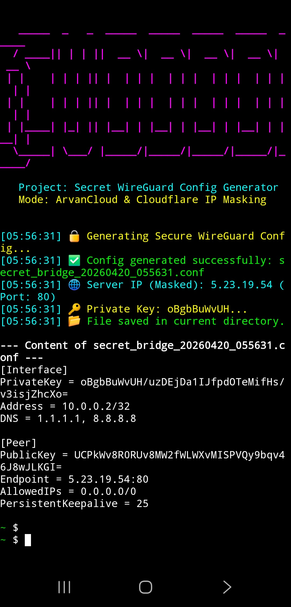

<p align="center">
  
</p>

# Wiregurd-Generator-Termux
This Super cool python script you can clone this on termux

# Big Bridge: Secure WireGuard Config Generator

A lightweight, cross-platform Python utility designed to generate secure, single-peer WireGuard configurations with dynamic IP masking. This tool helps obfuscate traffic by selecting endpoints from trusted IP ranges (ArvanCloud, Cloudflare), making tunnel traffic appear as standard HTTPS traffic.

## 🚀 Features

- **Automated Key Generation**: Uses native `wg` tools for cryptographically secure key pairs.
- **Traffic Obfuscation**: Dynamically selects server endpoints from ArvanCloud and Cloudflare IP ranges.
- **Single-Peer Architecture**: Generates optimized configs with a single peer for maximum performance.
- **Cross-Platform**: Fully compatible with Linux (Ubuntu/Debian) and Android (Termux).
- **Zero Dependencies**: Relies only on standard Python libraries and system `wireguard-tools`.

## 🛠️ Installation

### Prerequisites
- Python 3.6+
- `wireguard-tools` installed on the host system.

### Setup

1. **Install WireGuard Tools**

   **Linux (Ubuntu/Debian):**
   ```bash
   sudo apt update && sudo apt install wireguard
   
   curl -o WGAyhan.py https://raw.githubusercontent.com/AyhanMansur/Wiregurd-Generator-Termux/refs/heads/main/WGAyhan.py
   
   python3 WGAyhan.py

